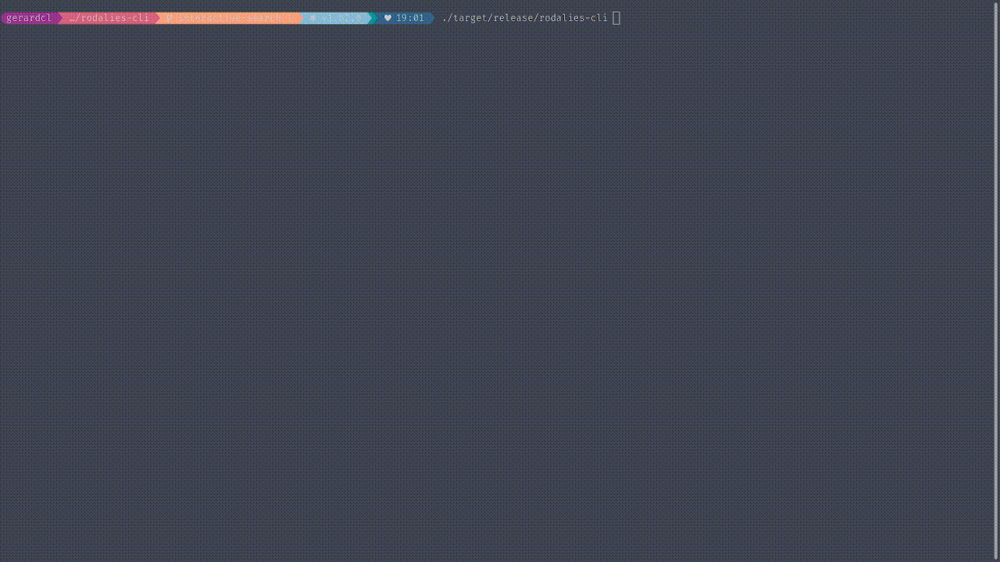

# Rodalies Timetables CLI

Timetables of the trains of Rodalies de la Generalitat de Catalunya on the terminal!

`rodalies-cli` is written in [Rust](https://www.rust-lang.org/) and published to [crates.io](https://crates.io/crates/rodalies-cli), with it you can get timetables faster, no need to open an app nor a browser anymore.

From release `1.0.0` one can search interactively the desired timetable. And, it has been refactored in a way that it is provided as a library too.

## Installation

### Release binaries download

After a release a github action updates it with x86_64 built binaries for:

* Linux

Run the following command to get the binary into your bin folder or tune it as you like:

```bash
curl -LO "https://github.com/gerardcl/rodalies-cli/releases/download/1.0.0/rodalies-cli-linux-amd64" && \
chmod +x rodalies-cli-linux-amd64 && mv rodalies-cli-linux-amd64 /usr/local/bin/rodalies-cli
```

**NOTE** you will need libssl or openssl development packages installed.

* MacOS

Run the following command to get the binary into your bin folder or tune it as you like:

```bash
curl -LO "https://github.com/gerardcl/rodalies-cli/releases/download/1.0.0/rodalies-cli-darwin-amd64" && \
chmod +x rodalies-cli-darwin-amd64 && mv rodalies-cli-darwin-amd64 /usr/local/bin/rodalies-cli
```

**NOTE** there is yet no M1 OS for github action supported, hence for M1 please do install via cargo (see next installation options).

* Windows

Run the following command to get the binary into your bin folder or tune it as you like:

```bash
curl -LO "https://github.com/gerardcl/rodalies-cli/releases/download/1.0.0/rodalies-cli-windows-amd64.exe" && \
chmod +x rodalies-cli-windows-amd64.exe && mv rodalies-cli-windows-amd64.exe /mingw64/bin/rodalies-cli.exe
```

**NOTE** this is expected to run well on Git Bash for Windows, but you can also get it running on your CMD or PowerShell. If using WSL then refer to the linux installation.

### Cargo install

1. You will need to have rust on your system, if not having it yet go to [installation page](https://www.rust-lang.org/tools/install)

2. Now use cargo to install it on your rust bin folder

```bash
cargo install rodalies-cli
```

### Manual build

1. You will need to have rust on your system, if not having it yet go to [installation page](https://www.rust-lang.org/tools/install)

2. Clone this repository

```bash
git clone https://github.com/gerardcl/rodalies-cli.git
```

3. Enter to the new cloned repo's folder and:

   * Use cargo to run it:

   ```bash
   cargo run -- --help
   ```

   * Or build it and move the binary to your bin's folder:

   ```bash
   cargo build --release
   cp target/release/rodalies-cli <to your preferred bin folder loctation>
   ```

## Usage

Once you have `rodalies-cli` installed just run the help command to understand what can you do:

```bash
$ rodalies-cli --help
rodalies-cli 1.0.0
Gerard C.L. <gerardcl@gmail.com>
CLI for searching train timetables of the trains of Rodalies de la Generalitat de Catalunya

USAGE:
    rodalies-cli [OPTIONS]

OPTIONS:
    -d, --day <day>                    The day value of the date to search for (default = today's day).
    -f, --from <from>                  The origin's station ID. [env: RODALIES_CLI_FROM=]
    -h, --help                         Print help information
    -i, --interactive <interactive>    Enable interactive train timetable search. If no value then it defaults to 'true'. [possible values: true, false]
    -m, --month <month>                The month value of the date to search for (default = today's month).
    -s, --search <search>              Search the ID of a given station's name pattern, to later use it on your origin or destination. [env: RODALIES_CLI_SEARCH=]
    -t, --to <to>                      The destinations's station ID. [env: RODALIES_CLI_TO=]
    -V, --version                      Print version information
    -y, --year <year>                  The year value of the date to search for (default = today's year).
```

**Long story short**: one can just run the naked command to start interactive mode. If not, then you will need to use the stations' IDs to define your origins and destinations manually. And, to know such IDs, you need to search for them by searching text patterns.

### Interactive search

Just type the naked command like:

```bash
$ rodalies-cli
...
```

See it in action:

[](media/rodalies-cli-usage.gif)

**NOTE**: One can specify another date with the right flags, like:

```bash
$ rodalies-cli -d 9 -m 9
...
```

### Searching stations' IDs and timetables

1. First search the IDs of your origin and destination stations:

```bash
$ rodalies-cli -s gir
🚂 Rodalies CLI 📅 Today's date is 02/08/2022
✨ Interactive mode enabled: 'false'
🔍 Searching stations that contain the text: 'gir'
+--------------+------------+
| Station name | Station ID |
+--------------+------------+
| Girona       |   79300    |
+--------------+------------+

$ rodalies-cli -s si
🚂 Rodalies CLI 📅 Today's date is 02/08/2022
✨ Interactive mode enabled: 'false'
🔍 Searching stations that contain the text: 'si'
+------------------------+------------+
| Station name           | Station ID |
+------------------------+------------+
| Cerdanyola-Universitat |   72503    |
| Sils                   |   79202    |
| Sitges                 |   71701    |
+------------------------+------------+
```

2. Search for today's timetable:

```bash
$ rodalies-cli -f 79300 -t 79202
🚂 Rodalies CLI 📅 Today's date is 02/08/2022
✨ Interactive mode enabled: 'false'
🔍 Searching timetable for date 02/08/2022
📆 Listing timetable with 0 transfers
+----------+-------+---------+-------+-------+---------+
| Duration | Train | Station | Start | End   | Station |
+----------+-------+---------+-------+-------+---------+
| 00:18    | R11   | Girona  | 06:04 | 06:22 | Sils    |
| 00:19    | R11   | Girona  | 06:19 | 06:38 | Sils    |
| 00:21    | RG1   | Girona  | 06:33 | 06:54 | Sils    |
| 00:18    | R11   | Girona  | 07:09 | 07:27 | Sils    |
| 00:16    | R11   | Girona  | 07:44 | 08:00 | Sils    |
| 00:19    | R11   | Girona  | 08:09 | 08:28 | Sils    |
| 00:19    | RG1   | Girona  | 08:40 | 08:59 | Sils    |
| 00:16    | R11   | Girona  | 08:49 | 09:05 | Sils    |
| 00:19    | R11   | Girona  | 09:39 | 09:58 | Sils    |
| 00:16    | R11   | Girona  | 10:19 | 10:35 | Sils    |
| 00:19    | RG1   | Girona  | 10:42 | 11:01 | Sils    |
| 00:19    | R11   | Girona  | 11:39 | 11:58 | Sils    |
| 00:16    | R11   | Girona  | 12:19 | 12:35 | Sils    |
| 00:19    | RG1   | Girona  | 12:42 | 13:01 | Sils    |
| 00:19    | R11   | Girona  | 13:39 | 13:58 | Sils    |
| 00:16    | R11   | Girona  | 14:19 | 14:35 | Sils    |
| 00:19    | RG1   | Girona  | 14:41 | 15:00 | Sils    |
| 00:16    | R11   | Girona  | 14:49 | 15:05 | Sils    |
| 00:19    | R11   | Girona  | 15:39 | 15:58 | Sils    |
| 00:16    | R11   | Girona  | 16:19 | 16:35 | Sils    |
| 00:19    | RG1   | Girona  | 16:42 | 17:01 | Sils    |
| 00:19    | R11   | Girona  | 17:09 | 17:28 | Sils    |
| 00:16    | R11   | Girona  | 17:49 | 18:05 | Sils    |
| 00:16    | R11   | Girona  | 18:19 | 18:35 | Sils    |
| 00:19    | R11   | Girona  | 18:39 | 18:58 | Sils    |
| 00:16    | R11   | Girona  | 19:19 | 19:35 | Sils    |
| 00:19    | RG1   | Girona  | 19:42 | 20:01 | Sils    |
| 00:19    | R11   | Girona  | 20:09 | 20:28 | Sils    |
| 00:19    | RG1   | Girona  | 20:42 | 21:01 | Sils    |
| 00:16    | R11   | Girona  | 20:59 | 21:15 | Sils    |
| 00:16    | R11   | Girona  | 21:19 | 21:35 | Sils    |
+----------+-------+---------+-------+-------+---------+
```

### Multiple transfers

If the timetable requires a transfer you will also see it:

```bash
$ rodalies-cli -f 79300 -t 71701
🚂 Rodalies CLI 📅 Today's date is 02/08/2022
✨ Interactive mode enabled: 'false'
🔍 Searching timetable for date 02/08/2022
📆 Listing timetable with 1 transfers
+----------+-------+---------+-------+-------+-----------------+--------+-------+-------+-------+---------+
| Duration | Train | Station | Start | Stop  | Transfer        | Wait   | Train | Start | End   | Station |
+----------+-------+---------+-------+-------+-----------------+--------+-------+-------+-------+---------+
| 02:18    | R11   | Girona  | 06:04 | 07:40 | Barcelona-Sants | 5 min  | R2    | 07:45 | 08:22 | Sitges  |
| 02:18    | R11   | Girona  | 06:19 | 07:55 | Barcelona-Sants | 11 min | R2    | 08:06 | 08:37 | Sitges  |
| 02:13    | R11   | Girona  | 07:09 | 08:40 | Barcelona-Sants | 5 min  | R2    | 08:45 | 09:22 | Sitges  |
| 02:08    | R11   | Girona  | 07:44 | 09:10 | Barcelona-Sants | 5 min  | R2    | 09:15 | 09:52 | Sitges  |
| 02:13    | R11   | Girona  | 08:09 | 09:40 | Barcelona-Sants | 5 min  | R2    | 09:45 | 10:22 | Sitges  |
| 02:03    | R11   | Girona  | 08:49 | 10:10 | Barcelona-Sants | 5 min  | R2    | 10:15 | 10:52 | Sitges  |
| 02:13    | R11   | Girona  | 09:39 | 11:10 | Barcelona-Sants | 5 min  | R2    | 11:15 | 11:52 | Sitges  |
| 02:03    | R11   | Girona  | 10:19 | 11:40 | Barcelona-Sants | 5 min  | R2    | 11:45 | 12:22 | Sitges  |
| 02:55    | RG1   | Girona  | 10:42 | 12:48 | Barcelona-Sants | 18 min | R2    | 13:06 | 13:37 | Sitges  |
| 02:13    | R11   | Girona  | 11:39 | 13:10 | Barcelona-Sants | 5 min  | R2    | 13:15 | 13:52 | Sitges  |
| 02:03    | R11   | Girona  | 12:19 | 13:40 | Barcelona-Sants | 5 min  | R2    | 13:45 | 14:22 | Sitges  |
| 02:55    | RG1   | Girona  | 12:42 | 14:48 | Barcelona-Sants | 18 min | R2    | 15:06 | 15:37 | Sitges  |
| 02:13    | R11   | Girona  | 13:39 | 15:10 | Barcelona-Sants | 5 min  | R2    | 15:15 | 15:52 | Sitges  |
| 02:03    | R11   | Girona  | 14:19 | 15:40 | Barcelona-Sants | 5 min  | R2    | 15:45 | 16:22 | Sitges  |
| 02:03    | R11   | Girona  | 14:49 | 16:10 | Barcelona-Sants | 5 min  | R2    | 16:15 | 16:52 | Sitges  |
| 02:13    | R11   | Girona  | 15:39 | 17:10 | Barcelona-Sants | 5 min  | R2    | 17:15 | 17:52 | Sitges  |
| 02:03    | R11   | Girona  | 16:19 | 17:40 | Barcelona-Sants | 5 min  | R2    | 17:45 | 18:22 | Sitges  |
| 02:13    | R11   | Girona  | 17:09 | 18:40 | Barcelona-Sants | 5 min  | R2    | 18:45 | 19:22 | Sitges  |
| 02:03    | R11   | Girona  | 17:49 | 19:10 | Barcelona-Sants | 5 min  | R2    | 19:15 | 19:52 | Sitges  |
| 02:03    | R11   | Girona  | 18:19 | 19:40 | Barcelona-Sants | 5 min  | R2    | 19:45 | 20:22 | Sitges  |
| 02:13    | R11   | Girona  | 18:39 | 20:10 | Barcelona-Sants | 5 min  | R2    | 20:15 | 20:52 | Sitges  |
| 02:03    | R11   | Girona  | 19:19 | 20:40 | Barcelona-Sants | 5 min  | R2    | 20:45 | 21:22 | Sitges  |
| 02:13    | R11   | Girona  | 20:09 | 21:40 | Barcelona-Sants | 5 min  | R2    | 21:45 | 22:22 | Sitges  |
| 02:14    | R11   | Girona  | 20:59 | 22:20 | Barcelona-Sants | 14 min | R2    | 22:34 | 23:13 | Sitges  |
| 02:18    | R11   | Girona  | 21:19 | 22:40 | Barcelona-Sants | 24 min | R2    | 23:04 | 23:37 | Sitges  |
+----------+-------+---------+-------+-------+-----------------+--------+-------+-------+-------+---------+
```

**NOTE**: The table will increase its width as per many transfers the timetable has.

```bash
$ rodalies-cli -f 79300 -t 72503
🚂 Rodalies CLI 📅 Today's date is 02/08/2022
✨ Interactive mode enabled: 'false'
🔍 Searching timetable for date 02/08/2022
📆 Listing timetable with 2 transfers
+----------+-------+---------+-------+-------+-----------------+--------+-------+-------+-------+------------------------------+-------+-------+-------+-------+------------------------+
| Duration | Train | Station | Start | Stop  | Transfer        | Wait   | Train | Start | Stop  | Transfer                     | Wait  | Train | Start | End   | Station                |
+----------+-------+---------+-------+-------+-----------------+--------+-------+-------+-------+------------------------------+-------+-------+-------+-------+------------------------+
| 02:18    | R11   | Girona  | 06:04 | 07:40 | Barcelona-Sants | 3 min  | R4    | 07:43 | 07:59 | Barcelona-Sant Andreu Arenal | 4 min | R7    | 08:03 | 08:22 | Cerdanyola-Universitat |
| 02:25    | R11   | Girona  | 06:19 | 07:55 | Barcelona-Sants | 6 min  | R3    | 08:01 | 08:17 | Barcelona-Sant Andreu Arenal | 7 min | R7    | 08:24 | 08:44 | Cerdanyola-Universitat |
| 02:33    | R11   | Girona  | 06:19 | 07:55 | Barcelona-Sants | 18 min | R4    | 08:13 | 08:29 | Barcelona-Sant Andreu Arenal | 4 min | R7    | 08:33 | 08:52 | Cerdanyola-Universitat |
| 02:55    | R11   | Girona  | 06:19 | 07:55 | Barcelona-Sants | 36 min | R3    | 08:31 | 08:47 | Barcelona-Sant Andreu Arenal | 7 min | R7    | 08:54 | 09:14 | Cerdanyola-Universitat |
| 03:03    | R11   | Girona  | 06:19 | 07:55 | Barcelona-Sants | 48 min | R4    | 08:43 | 08:59 | Barcelona-Sant Andreu Arenal | 4 min | R7    | 09:03 | 09:22 | Cerdanyola-Universitat |
| 02:35    | R11   | Girona  | 07:09 | 08:40 | Barcelona-Sants | 21 min | R3    | 09:01 | 09:17 | Barcelona-Sant Andreu Arenal | 7 min | R7    | 09:24 | 09:44 | Cerdanyola-Universitat |
| 02:43    | R11   | Girona  | 07:09 | 08:40 | Barcelona-Sants | 33 min | R4    | 09:13 | 09:29 | Barcelona-Sant Andreu Arenal | 4 min | R7    | 09:33 | 09:52 | Cerdanyola-Universitat |
| 02:26    | R11   | Girona  | 07:44 | 09:10 | Barcelona-Sants | 21 min | R3    | 09:31 | 09:47 | Barcelona-Sant Andreu Arenal | 4 min | R7    | 09:51 | 10:10 | Cerdanyola-Universitat |
| 02:31    | R11   | Girona  | 08:09 | 09:40 | Barcelona-Sants | 21 min | R3    | 10:01 | 10:17 | Barcelona-Sant Andreu Arenal | 4 min | R7    | 10:21 | 10:40 | Cerdanyola-Universitat |
| 03:01    | R11   | Girona  | 08:09 | 09:40 | Barcelona-Sants | 51 min | R3    | 10:31 | 10:47 | Barcelona-Sant Andreu Arenal | 4 min | R7    | 10:51 | 11:10 | Cerdanyola-Universitat |
| 02:51    | R11   | Girona  | 08:49 | 10:10 | Barcelona-Sants | 51 min | R3    | 11:01 | 11:17 | Barcelona-Sant Andreu Arenal | 4 min | R7    | 11:21 | 11:40 | Cerdanyola-Universitat |
| 02:31    | R11   | Girona  | 09:39 | 11:10 | Barcelona-Sants | 21 min | R3    | 11:31 | 11:47 | Barcelona-Sant Andreu Arenal | 4 min | R7    | 11:51 | 12:10 | Cerdanyola-Universitat |
| 02:21    | R11   | Girona  | 10:19 | 11:40 | Barcelona-Sants | 21 min | R3    | 12:01 | 12:17 | Barcelona-Sant Andreu Arenal | 4 min | R7    | 12:21 | 12:40 | Cerdanyola-Universitat |
| 02:51    | R11   | Girona  | 10:19 | 11:40 | Barcelona-Sants | 51 min | R3    | 12:31 | 12:47 | Barcelona-Sant Andreu Arenal | 4 min | R7    | 12:51 | 13:10 | Cerdanyola-Universitat |
| 02:58    | RG1   | Girona  | 10:42 | 12:48 | Barcelona-Sants | 13 min | R3    | 13:01 | 13:17 | Barcelona-Sant Andreu Arenal | 4 min | R7    | 13:21 | 13:40 | Cerdanyola-Universitat |
| 02:31    | R11   | Girona  | 11:39 | 13:10 | Barcelona-Sants | 21 min | R3    | 13:31 | 13:47 | Barcelona-Sant Andreu Arenal | 4 min | R7    | 13:51 | 14:10 | Cerdanyola-Universitat |
| 02:21    | R11   | Girona  | 12:19 | 13:40 | Barcelona-Sants | 21 min | R3    | 14:01 | 14:17 | Barcelona-Sant Andreu Arenal | 4 min | R7    | 14:21 | 14:40 | Cerdanyola-Universitat |
| 02:51    | R11   | Girona  | 12:19 | 13:40 | Barcelona-Sants | 51 min | R3    | 14:31 | 14:47 | Barcelona-Sant Andreu Arenal | 4 min | R7    | 14:51 | 15:10 | Cerdanyola-Universitat |
| 02:58    | RG1   | Girona  | 12:42 | 14:48 | Barcelona-Sants | 13 min | R3    | 15:01 | 15:17 | Barcelona-Sant Andreu Arenal | 4 min | R7    | 15:21 | 15:40 | Cerdanyola-Universitat |
| 02:31    | R11   | Girona  | 13:39 | 15:10 | Barcelona-Sants | 21 min | R3    | 15:31 | 15:47 | Barcelona-Sant Andreu Arenal | 4 min | R7    | 15:51 | 16:10 | Cerdanyola-Universitat |
| 02:21    | R11   | Girona  | 14:19 | 15:40 | Barcelona-Sants | 21 min | R3    | 16:01 | 16:17 | Barcelona-Sant Andreu Arenal | 4 min | R7    | 16:21 | 16:40 | Cerdanyola-Universitat |
| 02:51    | R11   | Girona  | 14:19 | 15:40 | Barcelona-Sants | 51 min | R3    | 16:31 | 16:47 | Barcelona-Sant Andreu Arenal | 4 min | R7    | 16:51 | 17:10 | Cerdanyola-Universitat |
| 02:51    | R11   | Girona  | 14:49 | 16:10 | Barcelona-Sants | 51 min | R3    | 17:01 | 17:17 | Barcelona-Sant Andreu Arenal | 4 min | R7    | 17:21 | 17:40 | Cerdanyola-Universitat |
| 02:31    | R11   | Girona  | 15:39 | 17:10 | Barcelona-Sants | 21 min | R3    | 17:31 | 17:47 | Barcelona-Sant Andreu Arenal | 4 min | R7    | 17:51 | 18:10 | Cerdanyola-Universitat |
| 02:21    | R11   | Girona  | 16:19 | 17:40 | Barcelona-Sants | 21 min | R3    | 18:01 | 18:17 | Barcelona-Sant Andreu Arenal | 4 min | R7    | 18:21 | 18:40 | Cerdanyola-Universitat |
| 02:51    | R11   | Girona  | 16:19 | 17:40 | Barcelona-Sants | 51 min | R3    | 18:31 | 18:47 | Barcelona-Sant Andreu Arenal | 4 min | R7    | 18:51 | 19:10 | Cerdanyola-Universitat |
| 02:31    | R11   | Girona  | 17:09 | 18:40 | Barcelona-Sants | 21 min | R3    | 19:01 | 19:17 | Barcelona-Sant Andreu Arenal | 4 min | R7    | 19:21 | 19:40 | Cerdanyola-Universitat |
| 02:21    | R11   | Girona  | 17:49 | 19:10 | Barcelona-Sants | 21 min | R3    | 19:31 | 19:47 | Barcelona-Sant Andreu Arenal | 4 min | R7    | 19:51 | 20:10 | Cerdanyola-Universitat |
| 02:21    | R11   | Girona  | 18:19 | 19:40 | Barcelona-Sants | 21 min | R3    | 20:01 | 20:17 | Barcelona-Sant Andreu Arenal | 4 min | R7    | 20:21 | 20:40 | Cerdanyola-Universitat |
| 02:31    | R11   | Girona  | 18:39 | 20:10 | Barcelona-Sants | 21 min | R3    | 20:31 | 20:47 | Barcelona-Sant Andreu Arenal | 4 min | R7    | 20:51 | 21:10 | Cerdanyola-Universitat |
| 02:21    | R11   | Girona  | 19:19 | 20:40 | Barcelona-Sants | 21 min | R3    | 21:01 | 21:17 | Barcelona-Sant Andreu Arenal | 4 min | R7    | 21:21 | 21:40 | Cerdanyola-Universitat |
| 02:51    | R11   | Girona  | 19:19 | 20:40 | Barcelona-Sants | 51 min | R3    | 21:31 | 21:47 | Barcelona-Sant Andreu Arenal | 4 min | R7    | 21:51 | 22:10 | Cerdanyola-Universitat |
| 02:31    | R11   | Girona  | 20:09 | 21:40 | Barcelona-Sants | 21 min | R3    | 22:01 | 22:17 | Barcelona-Sant Andreu Arenal | 4 min | R7    | 22:21 | 22:40 | Cerdanyola-Universitat |
+----------+-------+---------+-------+-------+-----------------+--------+-------+-------+-------+------------------------------+-------+-------+-------+-------+------------------------+
```

## Issues

Please, open an issue if you find any problem or you want to add a new feature. Happy to get contributions too!
